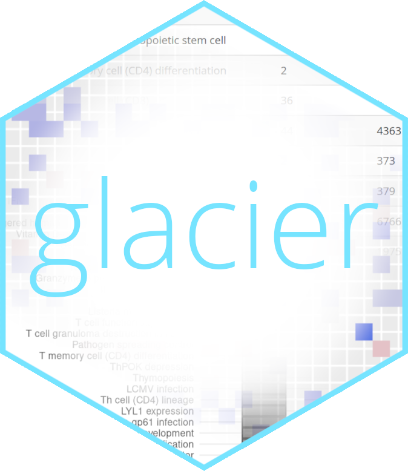

<!-- README.md is generated from README.Rmd. Please edit that file -->

glacier 
===================================================================

<!-- badges: start -->

[](https://github.com/lilin-yang/glacier/actions)
<!-- badges: end -->

The goal of glacier is to calculate annotation overlap statistics for
gene sets. This requires three inputs:

1.  A mapping from gene set names to annotations, typically in a `.csv`
    file.
2.  A mapping from gene set names to gene names, typically in a `.csv`
    file.
3.  A list of genes of interest.

Installation
------------

<!--
You can install the released version of glacier from [CRAN](https://CRAN.R-project.org) with:

``` r
install.packages("glacier")
```

And the development version from [GitHub](https://github.com/) with:
-->

You can install the development version of glacier from from
[GitHub](https://github.com/) with:

    # install.packages("devtools")
    devtools::install_github("lilin-yang/glacier")

Description
-----------

    library(glacier)

glacier has three main types of functions:

-   The `import_annotations()`, `import_database()`, `import_msigdb()`,
    `process_input_text()` and `process_input_seurat()` functions
    process raw data into a glacier-specific intermediate format.
-   The `compute()` function calculates overlap statistics from the
    inputs.
-   The `plot_statistics()` and `plot_overlap()` functions display the
    calculated statistics in a graph.

An example of these functions in action, as well as the supported input
formats, can be seen in `vignette("console", package = "glacier")`.

Web application
---------------

A web interface for those less familiar with R is also provided, and can
be started with `webstart()`. A guide to using the web interface can be
found in `vignette("web-app", package = "glacier")`.

As an alternative, an instance is hosted online at
[shinyapps.io](https://lilin-yang.shinyapps.io/glacier/).

Acknowledgements
----------------

This package was inspired by, and extends the functionality of the [GSEA
Compute Overlaps
tool](https://www.gsea-msigdb.org/gsea/msigdb/annotate.jsp).
