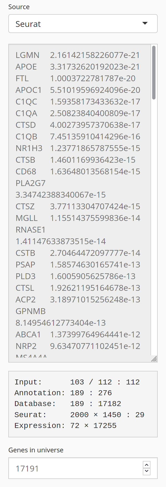
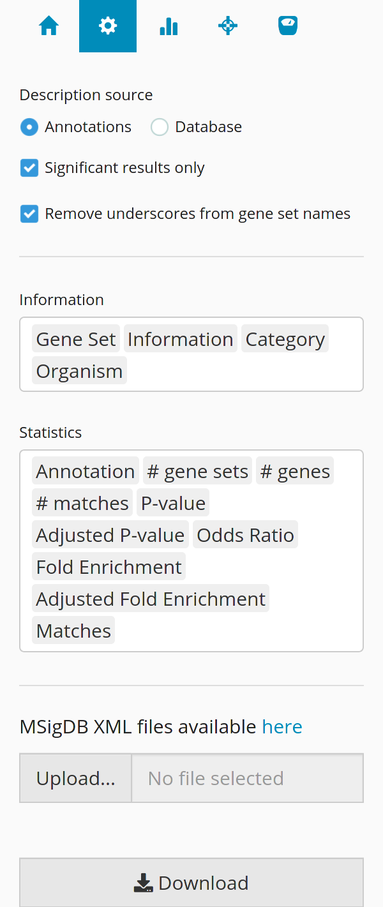
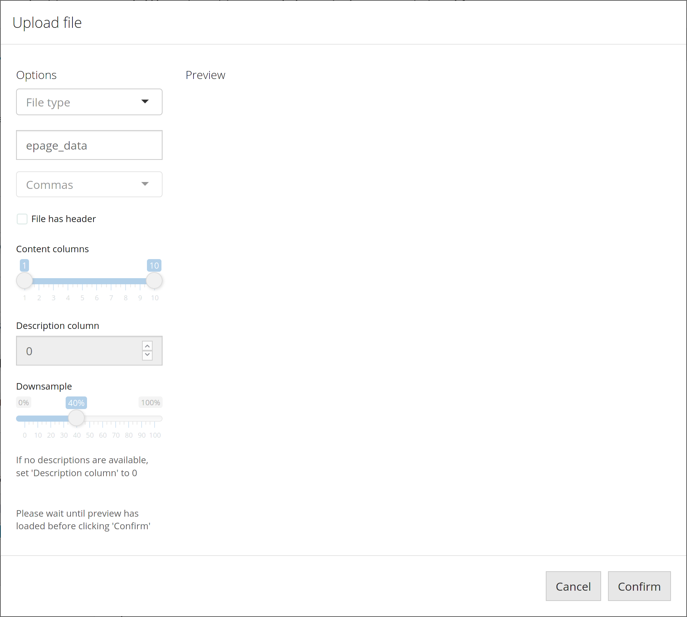
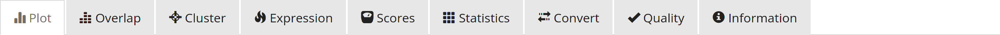

```{r, include = FALSE}
knitr::opts_chunk$set(
  collapse = TRUE,
  comment = "#>"
)
```

\newpage

# Introduction

The `webstart()` function launches a web interface for the `glacier` package,
allowing users who prefer not to use the console to access all features included
in the package. To get started, execute the following:

```{r eval = FALSE}
library(glacier)
webstart()
```

The default web browser will open to a local `glacier` session. Example files
included in the `extdata/*` directory of the `glacier` package will be
automatically loaded.

# Overview

On the left side of the web interface is the **sidebar**. This is where the
controls for inputs and outputs are located. On the right side of the web
interface is the **main panel**. This is where the outputs will be displayed.

Please note that this interface is designed to take advantage of 1080p or higher
displays. Users with displays under this resolution may need to scroll to access
some functions. However, the functionality of the web application will not be
compromised.

# Input pane



Shown above/below is the **input pane**. Here, there is an option for selecting
between input sources; an area for inputting a list of genes; a display of
input statistics and an option to configure the size of the gene universe.

Note duplicate genes are removed from the input, and if different values are
entered for the same gene, only the first value will be used.

The input source defaults to "Text Input", but can be changed to "Seurat" if
Seurat data is loaded. Selecting the "Seurat" option will replace the text input
with an automatically-generated list of differentially-expressed genes and their
adjusted P-values. This can be configured further in the **home pane**.

# Home pane


Shown above/below is the **home pane**. Here, there are options for selecting
which annotation, database and Seurat data files to use. There are also options
for selecting which subsets of the selected annotation and database files to
use. Controls for configuring the calculation of differentially-expressed genes
as mentioned above are also located here.

Subsets of the annotation file can be used for the analysis:

* **Gene Sets** uses the gene set names as annotations.
* **Symbols** uses the gene set names, but removes text up to the first
underscore.
* **Descriptions** uses the gene set descriptions, located in either the
annotation or database file. This can be configured in the **advanced pane**.
* **Manual** uses the manual annotations from the annotation file.
* **Automatic** attempts to extract annotations from the gene set descriptions.

The list of annotations can then be filtered further with regular expressions.

Subsets of the database file can also be selected, based on their source
category and organism. For regular databases, including the "Example" database
currently loaded, there are no categories nor organisms assigned to the gene
sets. This option is only useful after uploading an MSigDB XML file, from which
categories and organisms can be extracted. Uploading can be done from the
**advanced pane**.

# Advanced pane



Shown above/below is the **advanced pane**. Here, there are options to choose
the source of gene set descriptions, as well as an option to remove underscores
from gene set names. This affects the **Statistics** and **Information**
outputs, and is useful in preventing table wrapping issues. Below this are
options to configure which columns to show in the **Statistics** and
**Information** outputs.



Further down are the upload and download buttons. After uploading a file, the
**upload dialog** will be displayed. Users must select whether the file is an
annotation, database, MSigDB XML, Seurat RDS or Expression RDS file, and provide
a name for the application to use. Options below are specified for annotation
and database files, including which file delimiter to use, whether the file has
a header as well as which columns to use for content and descriptions.

Annotations and databases should be stored in `.csv` files, with the gene set
name in the first column, followed by annotations or genes in the succeeding
columns. Further information on the format, including examples, are available in
`vignette("console", package = "glacier")`.

The download button will initiate the download of a `.csv` file containing the
statistics calculated.

# Plot configuration pane


Shown above/below is the **plot pane**. Here, there are options for
configuring the **Plot** output, including the values and coloring of the bars,
as well as transformations for the scale of the values and colors.

Below this is a slider to select which annotations to plot, limited to 80 at a
time. Additionally, there is an option to arrange the annotations displayed in
the plot in descending order of value.

Below, there are options for configuring the **Overlap** output, including the
coloring and scale adjustment of the boxes. The plot will omit boxes with NA,
NaN, Inf and -Inf values, so the "Gene Value", "Odds Ratio", "Fold Enrichment"
and "Adjusted Fold Enrichment" options should be used with caution.

Below this are sliders for selecting annotations and genes, limited to 80 and
100 respectively.

# Seurat data pane


Shown above/below is the **Seurat data pane**. Here, there are options for
configuring the **Cluster** and **Expression** outputs. Here, there is an option
to visualize different clustering techniques, if they have been generated prior
to upload.

Below this are options to configure the **Expression** output. The expression
plot can show a "Dot Plot", "Feature Plot", "Heatmap", "Ridge Plot" or "Violin
Plot". Users can select which genes to visualize, based on the annotation
selected. There is an option to restrict the gene list to those entered as
input, along with an option to cluster the genes based on their expression.
"Empty" annotations with no genes matching the criteria are omitted from the
annotation selection.

\newpage

# Outputs



In the **main panel**, users can select which outputs to view:

* **Plot** displays the bar plot.
* **Overlap** displays the gene-annotation overlap plot.
* **Cluster** displays the overview plot for the Seurat data, if available.
* **Expression** displays the Seurat gene expression plot.
* **Scores** displays the calculated scores.
* **Statistics** displays the calculated statistics. Note that this table can be
configured to show a list of all annotations by deselecting all other columns in
the **advanced pane**.
* **Convert** displays a list of converted gene names.
* **Quality** displays a list of all annotations, gene sets and genes, and
whether they are found in the annotation, database, Seurat or Input data.
* **Information** displays information about gene sets, and is only useful if
the database selected was imported from an MSigDB file.
